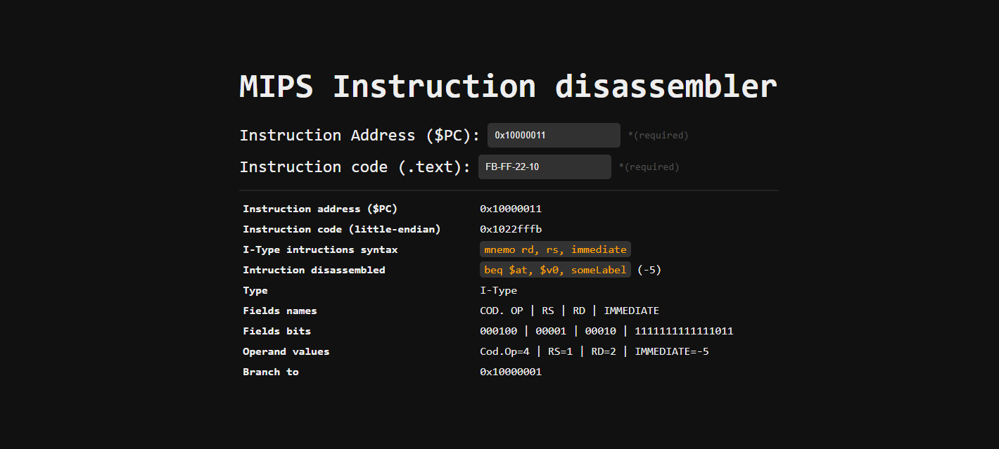

# MIPS Instruction Disassembler

> 📖 This tool will disassemble MIPS instructions based on the instruction code (*big-endian*) and the PC value.

> 🧰 **Features:**
> 
> What the tool will calculate after the required information is provided
> 
> - Instruction code (*little-endian*)
> - Instruction format syntax
> - Disassembled instruction
> - Instruction type
> - Instruction fields
> - Branch/Jump target address

> 💡 Try it [here](https://www.0xporti.com/mips-disassembler) online

-------------------------------------------------------------

## 📟 Run 

The server can be run in different ways. The following are some of the most common ways to run a server.

#### LiveServer (VSCode Extension)

1. Install [LiveServer](https://marketplace.visualstudio.com/items?itemName=ritwickdey.LiveServer) extension for VSCode.
2. Open the project folder in VSCode.
3. Click on the "Go Live" button at the bottom of the VSCode window (*bottom-right corner*). 
4. Open the browser and go to the URL provided by LiveServer.
  
#### Python

1. Open the project folder in VSCode.
2. Open the terminal (*on the folder path*).
3. Run the following command: `python -m http.server 3000`.
4. Open the browser and visit the URL [localhost:3000](http://localhost:3000).
   
#### Other servers managers (*XAMPP, WAMP, etc.*)

Follow the official documentation of the server manager you plan to use

-------------------------------------------------------------

## 💭 Usage

> 🧠 The tool pretents to ease the task of reading an instruction from the `.text` segment. The user is supposed to enter the value of `$PC` (*format: `0xXXXXXXXX`*) in the first textbox. Then the user must enter de values of the bytes stored at the addresses: `0($PC)` , `1($PC)` , `2($PC)` , `3($PC)` (*in the order shown*) in the second textbox. This values can be separated by the character `-` , but this is optional.

1. Enter the instruction code (*big-endian*), separate values using a *dash* (`-`) *E.G.: `78-56-34-12` for the instruction code `0x12345678`*. Optionaly, you can only type the 8 hexadecimal digits and the tool will auto complete with the dashes
2. Enter the PC value using the prefix `0x`. E.G.: `0x0800001c`

-------------------------------------------------------------

